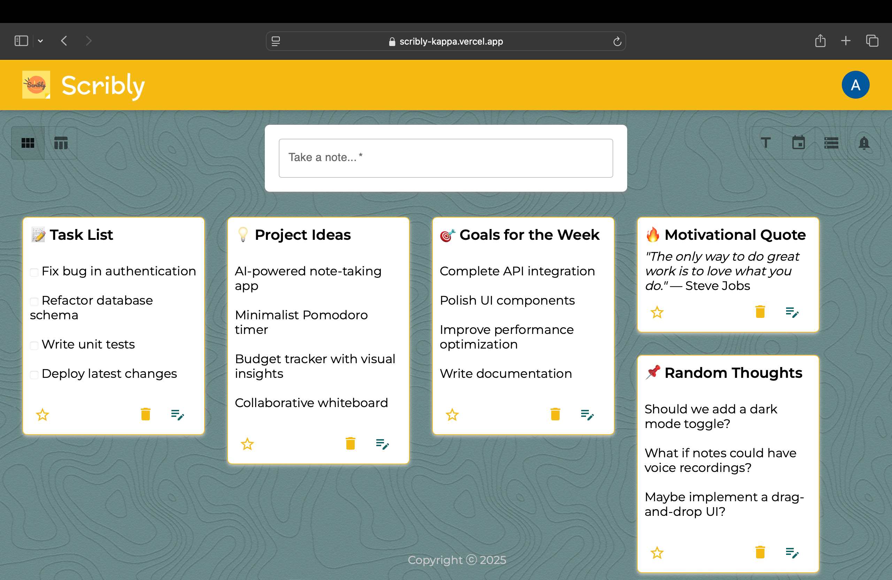

[![Contributors][contributors-shield]][contributors-url]
[![Forks][forks-shield]][forks-url]
[![Stargazers][stars-shield]][stars-url]
[![Issues][issues-shield]][issues-url]
[![LinkedIn][linkedin-shield]][linkedin-url]


<!-- PROJECT LOGO -->
<br /> 
<div align="center">
  <a href="https://github.com/akash85246/Scribly">
    
  </a>

  <h3 align="center">SCRIBLY</h3>

  <p align="center">
    Effortless Sticky Notes with Smart Alerts & Customization!
    <br />
    <a href="https://github.com/akash85246/Scribly/issues/new?labels=bug">Report Bug</a>
    ·
    <a href="https://github.com/akash85246/Scribly/issues/new?labels=enhancement">Request Feature</a>
    .
    <a href="https://github.com/akash85246/Scribly/blob/main/CONTRIBUTING.md">Contribute</a>
    .
    <a href="https://github.com/akash85246/Scribly/pulls">Pull Requests</a>
    .
    <a href="https://github.com/akash85246/Scribly/security">Report Security Issue</a>
    .
    <a href="https://github.com/akash85246/Scribly/fork">Fork the Project</a>
  </p>
</div>


<!-- TABLE OF CONTENTS -->
<details>
  <summary>Table of Contents</summary>
  <ol>
    <li>
      <a href="#about-the-project">About The Project</a>
      <ul>
        <li><a href="#features">Features</a></li>
        <li><a href="#built-with">Built With</a></li>
      </ul>
    </li>
    <li>
      <a href="#getting-started">Getting Started</a>
      <ul>
        <li><a href="#prerequisites">Prerequisites</a></li>
        <li><a href="#installation">Installation</a></li>
      </ul>
    </li>
    <li><a href="#usage">Usage</a></li>
    <li><a href="#additional-notes">Additional Notes</a></li>
    <li><a href="#roadmap">Roadmap</a></li>
    <li><a href="#contributing">Contributing</a></li>
    <li><a href="#contact">Contact</a></li>
    <li><a href="#acknowledgments">Acknowledgments</a></li>
  </ol>
</details>


<!-- ABOUT THE PROJECT -->
## About The Project

[](public/Scribly-sample.png)

Scribly is a modern sticky note web app designed to enhance productivity and organization. With a sleek and intuitive interface, it allows users to effortlessly add, edit, delete, and organize notes. 
### Features

- 🔐 **Google Authentication** – Sign in seamlessly with your Google account  
- 🔔 **Push Notifications** – Get real-time alerts for reminders  
- 🌙 **Dark Mode** – Switch effortlessly between light and dark themes  
- 🎨 **Customizable Background** – Personalize your workspace to match your style  
- 🖱️ **Drag & Drop** – Organize your notes with a smooth drag-and-drop experience  
- 📌 **Multiple Views** – Choose between **Table View** and **Card View** for better organization  
- 📊 **Advanced Sorting** – Sort notes by **title, content, creation date, or alert date** for quick access  


<p align="right">(<a href="#readme-top">back to top</a>)</p>


### Built With

Built with cutting-edge technologies to deliver performance and reliability.

- [![React][React.js]][React-url]  
- [![Express][Express.js]][Express-url]  
- [![Node.js][Node.js]][Node-url]  
- [![PostgreSQL][Postgres]][Postgresql-url]  
- [![Vercel][Vercel]][Vercel-url]  
- [![Git][Git]][Git-url]  
- [![GitHub][GitHub]][GitHub-url]  
- [![CSS][CSS]][CSS-url]  
- [![Google Auth][GoogleAuth]][GoogleAuth-url] 

<p align="right">(<a href="#readme-top">back to top</a>)</p>


<!-- GETTING STARTED -->
## Getting Started

Get started quickly with these easy setup instructions.

### Prerequisites  

Before setting up the project, ensure you have the following installed:  

- **Node.js** – [Download Node.js](https://nodejs.org/) (LTS version recommended)  
- **PostgreSQL** – Install and configure PostgreSQL for database management ([Download PostgreSQL](https://www.postgresql.org/download/))  
- **npm or Yarn** – Comes with Node.js; used to install project dependencies  
- **Git** – [Download Git](https://git-scm.com/) to clone the repository  
- **Vercel Account** – If deploying on Vercel, create a free account at [Vercel](https://vercel.com/)  
- **Google Cloud Project** – Set up a Google Cloud project for Google Authentication ([Guide](https://developers.google.com/identity))  
- **React** – No additional setup required, but familiarity with its API may be useful ([Open Library API Docs](https://openlibrary.org/dev/docs/api/covers))  

Additionally, having a basic understanding of the following will be helpful:  

- **CSS** – For styling and responsive design adjustments  

### Installation

Follow these steps to set up the project locally:

1. **Clone the Repository**
   ```bash
   git clone https://github.com/akash85246/Scribly.git
   cd Scribly

2. Install Dependencies
    ```sh
   npm install
   ```
3. Set Up Environment Variables
   ```env 
   VITE_BASE_URL=<frontend-url>  # Example: http://localhost:5174

    VITE_BACKEND_URL=<backend-url>  # Example: http://localhost:5001
    
    VITE_PORT=<frontend-port>  # Default: 5174
    VITE_WEB_PUSH_PUBLIC_KEY=<your-web-push-public-key>

   ```
4. Change git remote url to avoid accidental pushes to base project
   ```sh
   git remote set-url origin github_username/repo_name
   git remote -v # confirm the changes
   ```
5. Run the Project
    ```sh
   npm run dev
   ```

<p align="right">(<a href="#readme-top">back to top</a>)</p>


<!-- USAGE EXAMPLES -->
## Usage

Once the project is running, you can use the following features:

1. **Google Authentication**  
   - Click the **"Sign in with Google"** button on the homepage.  
   - Sign in using your Google account to access your personalized dashboard.  

2. **Add Sticky Note**  
   - Click the **"New"** button in the navigation bar.  
   - Enter the note details (title, content, and optional alert).  
   - Save your note, which will be displayed on the main page.  

3. **Edit Sticky Note**  
   - Browse your existing notes on the homepage.  
   - Click on a note to edit its content.  
   - Alternatively, use the **search bar** to find a specific note quickly.  

4. **Add Alert**  
   - Set a reminder for a note while creating or editing it.  
   - Receive **push notifications** when the alert time is reached.  

5. **Dark Mode**  
   - Toggle between **light and dark themes** from the settings.  
   - Your preference is saved for a seamless experience.  

6. **Drag & Drop Sticky Notes**  
   - Rearrange notes effortlessly by dragging them around.  
   - Organize your notes in a way that suits your workflow.  

7. **Change View**  
   - Switch between **Table View** and **Card View** for better note management.  

8. **Sort Notes**  
   - Sort notes based on **title, content, creation date, and alert date**. 

9. **Responsive Design**  
   - Works flawlessly on **both desktop and mobile devices**.  


## Additional Notes

- **Database**: Ensure that your PostgreSQL database is running and properly seeded with initial data if required.
- **Deployment**: The project can also be deployed to platforms like Vercel or Netlify for wider access.
- **Customization**: Modify the `.env` file for custom configurations such as port, Google credentials, or database URLs.

<p align="right">(<a href="#readme-top">back to top</a>)</p>


<!-- ROADMAP -->
<!-- ROADMAP -->
## Roadmap  

Here are the planned improvements and features for the project:  

- [x] Google Authentication for user login.  
- [x] Sticky note management (add, edit, delete notes).  
- [x] Push notifications for note alerts.  
- [x] Dark mode toggle for better accessibility.  
- [x] Drag & drop functionality for note organization.  
- [x] Sort notes by title, content, creation date, and alert date.  
- [x] Toggle between **Table View** and **Card View**.  
- [x] Responsive design for both desktop and mobile devices.  
- [x] Customizable themes for better personalization.  

See the [open issues](https://github.com/akash85246/Scribly/issues) for a full list of proposed features (and known issues).

<p align="right">(<a href="#readme-top">back to top</a>)</p>


<!-- CONTRIBUTING -->
## Contributing

Contributions are what make the open source community such an amazing place to learn, inspire, and create. Any contributions you make are **greatly appreciated**.

If you have a suggestion that would make this better, please fork the repo and create a pull request. You can also simply open an issue with the tag "enhancement".
Don't forget to give the project a star! Thanks again!

1. **Fork the Project**
   - Click the "Fork" button at the top-right corner of this page to create a copy of the repository in your GitHub account.

2. **Clone the Repository**
   - Clone your forked repository to your local machine:
     ```bash
     git clone https://github.com/your-username/Scribly.git
     ```

3. **Create Your Feature Branch**
   - Navigate to your project folder and create a new branch for your feature:
     ```bash
     git checkout -b feature/AmazingFeature
     ```

4. **Commit Your Changes**
   - After making the necessary changes, commit them:
     ```bash
     git commit -m 'Add some AmazingFeature'
     ```

5. **Push to the Branch**
   - Push your changes to your forked repository:
     ```bash
     git push origin feature/AmazingFeature
     ```

6. **Open a Pull Request**
   - Go to the original repository (`akash85246/Scribly`), and open a pull request to merge your feature branch into the `main` branch.
   - Provide a brief description of the changes you've made and submit the pull request for review.

### Top contributors:

<a href="https://github.com/akash85246/Scribly/graphs/contributors">
  
</a>

<p align="right">(<a href="#readme-top">back to top</a>)</p>

<!-- CONTACT -->
## Contact

Akash Rajput - [@akash_rajp91025](https://x.com/akash_rajp91025) - akash.rajput.dev@gmail.com

Project Link: [https://github.com/akash85246/Scribly](https://github.com/akash85246/Scribly)

<p align="right">(<a href="#readme-top">back to top</a>)</p>


<!-- ACKNOWLEDGMENTS -->
## Acknowledgments  

I would like to extend my gratitude to the following resources and individuals:  

- **Google Authentication** – For enabling secure sign-in functionality.  
- **Vercel** – For providing seamless deployment and hosting for the frontend.  
- **PostgreSQL** – For offering a robust and scalable database solution.  
- **Node.js & Express.js** – For powering the backend and handling API requests.  
- **React.js** – For building a dynamic and interactive user interface.  
- **Redux** – For managing application state efficiently.  
- **Web Push API** – For enabling push notifications to alert users.  
- **Draggable.js** – For implementing smooth drag-and-drop functionality.  
- **MDN & DevDocs** – For providing excellent documentation and resources.  
- **Open Source Community** – For their contributions to the tools and libraries that made Scribly possible.  
- **Friends & Peers** – For feedback and testing that helped improve the project.

<p align="right">(<a href="#readme-top">back to top</a>)</p>


<!-- MARKDOWN LINKS & IMAGES -->
[contributors-shield]: https://img.shields.io/github/contributors/akash85246/Scribly.svg?style=for-the-badge
[contributors-url]: https://github.com/akash85246/Scribly/graphs/contributors
[forks-shield]: https://img.shields.io/github/forks/akash85246/Scribly.svg?style=for-the-badge
[forks-url]: https://github.com/akash85246/Scribly/network/members
[stars-shield]: https://img.shields.io/github/stars/akash85246/Scribly.svg?style=for-the-badge
[stars-url]: https://github.com/akash85246/Scribly/stargazers
[issues-shield]: https://img.shields.io/github/issues/akash85246/Scribly.svg?style=for-the-badge
[issues-url]: https://github.com/akash85246/Scribly/issues
[linkedin-shield]: https://img.shields.io/badge/-LinkedIn-black.svg?style=for-the-badge&logo=linkedin&colorB=555
[linkedin-url]: https://www.linkedin.com/in/akash-rajput-68226833a/
[product-screenshot]: ./public/images/ScriblyHome.png
[Express.js]: https://img.shields.io/badge/Express-000000?style=flat&logo=express&logoColor=white
[Node.js]: https://img.shields.io/badge/Node.js-339933?style=flat&logo=node.js&logoColor=white
[Postgres]: https://img.shields.io/badge/Postgres-336791?style=flat&logo=postgresql&logoColor=white
[Render]: https://img.shields.io/badge/Render-343a40?style=flat&logo=render&logoColor=white
[Git]: https://img.shields.io/badge/Git-F05032?style=flat&logo=git&logoColor=white
[GitHub]: https://img.shields.io/badge/GitHub-181717?style=flat&logo=github&logoColor=white
[CSS]: https://img.shields.io/badge/CSS-1572B6?style=flat&logo=css3&logoColor=white
[EJS]: https://img.shields.io/badge/EJS-49B58E?style=flat&logo=ejs&logoColor=white
[GoogleAuth]: https://img.shields.io/badge/Google_Auth-4285F4?style=for-the-badge&logo=google


[React.js]: https://img.shields.io/badge/React-20232A?style=for-the-badge&logo=react&logoColor=61DAFB
[React-url]: https://reactjs.org/

[Express.js]: https://img.shields.io/badge/Express.js-000000?style=for-the-badge&logo=express&logoColor=white
[Express-url]: https://expressjs.com/

[Node.js]: https://img.shields.io/badge/Node.js-43853D?style=for-the-badge&logo=node.js&logoColor=white
[Node-url]: https://nodejs.org/

[Postgres]: https://img.shields.io/badge/PostgreSQL-316192?style=for-the-badge&logo=postgresql&logoColor=white
[Postgresql-url]: https://www.postgresql.org/

[Vercel]: https://img.shields.io/badge/Vercel-000000?style=for-the-badge&logo=vercel&logoColor=white
[Vercel-url]: https://vercel.com/

[Git]: https://img.shields.io/badge/Git-F05032?style=for-the-badge&logo=git&logoColor=white
[Git-url]: https://git-scm.com/

[GitHub]: https://img.shields.io/badge/GitHub-181717?style=for-the-badge&logo=github&logoColor=white
[GitHub-url]: https://github.com/

[CSS]: https://img.shields.io/badge/CSS-1572B6?style=for-the-badge&logo=css3&logoColor=white
[CSS-url]: https://developer.mozilla.org/en-US/docs/Web/CSS

[GoogleAuth]: https://img.shields.io/badge/Google%20Auth-4285F4?style=for-the-badge&logo=google&logoColor=white
[GoogleAuth-url]: https://developers.google.com/identity